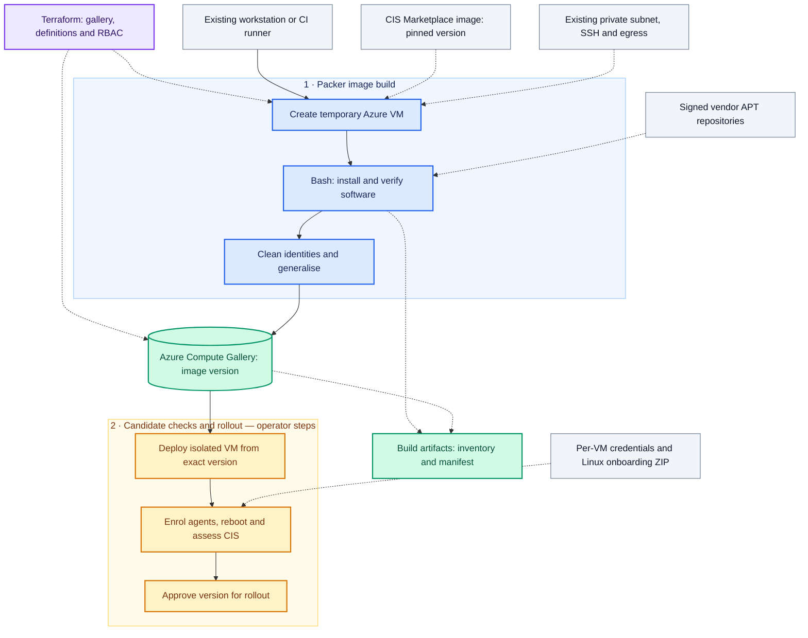

# CIS Ubuntu 24.04 GitLab Runner image

Build a reusable Azure VM image from **CIS Hardened Ubuntu Server 24.04 LTS, Level 1, Gen2**, adding Datadog Agent, Docker Engine, the Docker Compose plugin, GitLab Runner and Microsoft Defender for Endpoint. Ubuntu 22.04 is also supported as a separate source/definition.

**Packer builds the image. Terraform provisions the Azure image gallery and build permissions. Bash implements provisioning and post-deployment enrolment.** Azure Image Builder is not required.

The result is a complete VM image stored as a version in Azure Compute Gallery. It is initially excluded from `latest` so a candidate cannot silently become the default production image.

## What is included

| Component | Image contents | Per-VM action after deployment |
|---|---|---|
| Docker | Engine, CLI, containerd, Buildx | Enabled on boot; configure workload networking |
| Compose | Official `docker-compose-plugin` | Use `docker compose` |
| GitLab Runner | Runner and matching helper images package | Register using a `glrt-` authentication token |
| Datadog | Agent 7 from the official signed APT repository | Supply the correct site/API key and start the service |
| Defender | `mdatp` from Microsoft's production repository | Apply the Linux onboarding package and verify health |

Datadog, Runner and Defender services are disabled until configured on each deployed VM. The image is **not protected by Defender or reporting to Datadog until those steps finish**. Keep new VMs isolated until enrolment and smoke tests pass.

No Datadog keys, runner tokens or Defender onboarding packages belong in Git, Packer variables, Terraform state or the golden image. This is a deliberate reusable, tenant-neutral image design; Microsoft also supports pre-onboarded golden images, but that is not implemented here.

## How the image is built

The starting point is **CIS's existing hardened Ubuntu image from Azure Marketplace**. Packer customises a temporary VM created from that image and captures the result as a new version in your Azure Compute Gallery.

1. **Prepare Azure with Terraform.** Create the build resource group, gallery, image definitions, managed identity and scoped permissions. The VNet and build subnet must already exist.
2. **Select the CIS source.** Resolve an explicit regional Marketplace image version and its purchase plan, then review and accept the terms in the build subscription.
3. **Create a temporary VM with Packer.** The existing workstation or CI runner needs Azure authentication and SSH connectivity to the VM's private IP. The VM needs outbound access to the package repositories.
4. **Install and verify the software.** Packer uploads the Bash scripts, which install Docker, Compose, GitLab Runner, Datadog Agent and Defender. Package and CLI checks run, and the package inventory is exported.
5. **Seal and capture the VM.** The scripts remove machine-specific identities and deprovision the VM. Packer publishes a generalised image version, then cleans up its temporary build resources after a successful build. The Terraform-managed gallery and build resource group remain; inspect leftovers after failures.
6. **Test a deployed candidate.** Deploy from the exact gallery version, enrol the agents, reboot, run a real GitLab job and reassess CIS compliance before approving that version for rollout.

### Process and dependencies

Solid arrows show the build and release sequence. Dotted arrows show prerequisites or supporting outputs. Colour separates infrastructure, build steps, image storage and release checks; labels carry the same meaning.

> [!IMPORTANT]
> Agent credentials and the Defender onboarding ZIP are supplied **after deployment**, not during image capture. The candidate deployment, enrolment and release checks are operator steps; the current pipeline does not automate them.

## Where the finished image is stored

The VM image is stored in **Azure Compute Gallery in your subscription**. The destination comes from the Packer variables in [the environment example](config/azure.example.pkrvars.hcl), matched to the Terraform outputs.

| Destination setting | Example value |
|---|---|
| Subscription | Your configured Azure subscription ID |
| Resource group | `rg-image-gallery` |
| Azure Compute Gallery | `company_images` |
| Image definition | `cis-ubuntu-2404-runner` |
| Image version | `1.0.0` |
| Target region | `uksouth` |
| Replica storage | `Standard_LRS`, one replica in the target region |

In the Azure portal, open **Azure Compute Galleries → company_images → cis-ubuntu-2404-runner → Versions → 1.0.0**. These are example names; substitute the values configured for your environment.

The image-version resource ID has this structure:

`/subscriptions/<subscription-id>/resourceGroups/rg-image-gallery/providers/Microsoft.Compute/galleries/company_images/images/cis-ubuntu-2404-runner/versions/1.0.0`

Use that exact version ID when deploying candidate VMs. Keep the source Marketplace purchase plan in the VM deployment configuration.

The build host also receives small files under `artifacts/`; these are build records, not a downloadable VM image:

| File | Contents |
|---|---|
| `packages.tsv` | Installed package inventory |
| `resolved-package-pins.json` | Resolved versions of the requested packages |
| `packer-manifest.json` | Packer build result and source metadata |

The optional GitLab build job retains these files as CI artifacts for 30 days. The image version remains in Azure independently of that artifact retention period.

> [!TIP]
> Each published version is initially **excluded from `latest`**. Test and approve an explicit version before rollout. Installing additional software changes the CIS baseline, so the derived image needs its own compliance assessment.

> [!NOTE]
> Repository validation has passed, but an Azure image build and agent onboarding have not yet been performed. Pushing this repository runs validation; it does not create the image automatically.

## Repository layout

| Path | Purpose |
|---|---|
| `packer/` | Azure builder, CIS source, private build VM, gallery publication |
| `infra/terraform/` | AVM gallery, image definitions, managed identity, OIDC trust and scoped RBAC |
| `scripts/` | Bash installation, verification, sealing, enrolment and build orchestration |
| `tests/test.sh` | Bash security/input tests with local fixtures |
| `config/` | Non-secret configuration examples and optional package pins |
| `.github/workflows/validate.yml` | Bash checks and native Packer/Terraform validation; no Azure deployment |
| `.gitlab-ci.yml` | Existing private runner validation and manually triggered image build |
| `docs/` | Deployment, security, maintenance and verification notes |

## Prerequisites

- An Azure subscription that permits the CIS Marketplace offer and its charges. Image customisation does not remove the originating Marketplace terms or fees.
- Registered `Microsoft.Compute`, `Microsoft.Network`, `Microsoft.ManagedIdentity` and `Microsoft.MarketplaceOrdering` resource providers. Terraform intentionally does not auto-register providers.
- Bash 4+, jq, unzip, zip, ShellCheck, Packer 1.14 or later, Terraform 1.9 or later and Azure CLI on the machine running the build.
- An **existing** VNet and build subnet, explicit outbound connectivity to approved repositories, and a routed SSH path from the Packer host to the build VM's private IP. Terraform does not replace your landing-zone networking, DNS, NSGs, firewall or egress rules.
- Sufficient Azure VM quota for the selected build size. The example uses `Standard_D4s_v5` and a 128 GB OS disk.
- A provisioning principal allowed to create resource groups, managed identities, custom roles and role assignments. The image-build identity has narrower, resource-scoped permissions.

The first image build must run from an existing workstation/runner. The new GitLab Runner image cannot bootstrap the infrastructure that creates itself.

## First build: Ubuntu 24.04

Run all commands from the repository root. These are CLI invocations, not installation scripts.

1. Sign in with `az login`, then select the intended subscription using `az account set --subscription <subscription-id>`.

2. Resolve a real regional CIS source and purchase plan:
   `bash scripts/factory.sh resolve 24.04 uksouth`.
   This creates `artifacts/source-24.04.pkrvars.json` with an **explicit version**, plus the full Marketplace metadata. The resolver fails if the expected SKU is unavailable; list the publisher's available SKUs in Azure before making any substitution. It never silently switches to a standard Ubuntu image.

3. Review the offer's terms. Accept them for the intended subscription with `az vm image terms accept --urn <publisher:offer:sku:resolved-version>`. Use the values returned in step 2. A deployment identity that cannot accept terms should have a subscription administrator do this once.

4. Copy `infra/terraform/terraform.example.tfvars` to `infra/terraform/terraform.tfvars`. Set subscription, region, existing network and optional local-builder Entra object IDs. Copy the verified purchase-plan values from step 2 into the `images` map. Remove the 22.04 entry if only building 24.04. Configure GitLab OIDC only when you intend to use the GitLab pipeline.

5. Select your organisation's Terraform remote-state backend before a shared deployment. The starter has no backend credentials and otherwise uses local state. Run `terraform -chdir=infra/terraform init`, `terraform -chdir=infra/terraform plan -out=image-factory.tfplan`, review the plan, then `terraform -chdir=infra/terraform apply image-factory.tfplan`. Commit the generated `.terraform.lock.hcl` once provider installation succeeds.

6. Copy `config/azure.example.pkrvars.hcl` to `config/azure.pkrvars.hcl`. Match the Terraform outputs, choose `cis-ubuntu-2404-runner`, and set a new gallery `image_version`. The Packer build resource group's region must equal the destination region. Ensure Azure CLI's active subscription matches the configuration.

7. Run `bash tests/test.sh` and `shellcheck -x scripts/*.sh scripts/lib/*.sh tests/*.sh`. Packer uploads the scripts directly; there is no compilation or application runtime to publish.

8. Check prerequisites and the Packer template with `bash scripts/factory.sh check config/azure.pkrvars.hcl artifacts/source-24.04.pkrvars.json`.

9. Build with `bash scripts/factory.sh build config/azure.pkrvars.hcl artifacts/source-24.04.pkrvars.json`. This creates billable Azure build resources and publishes the image version. A failed build must be investigated before rerunning; inspect any leftover temporary resources.

10. Deploy an isolated VM using the **exact output gallery image-version resource ID**, retaining the source purchase plan in the VM's `plan` block. Complete [per-VM enrolment](docs/enrolment.md), reboot and run the [release checks](docs/security-and-maintenance.md). Approve that exact version for deployment only after the checks pass.

## Ubuntu 22.04

Run `bash scripts/factory.sh resolve 22.04 <region>` instead, retain the 22.04 gallery definition and set `image_definition_name` to `cis-ubuntu-2204-runner`. Pass `artifacts/source-22.04.pkrvars.json` into `check` and `build`. The installer selects `jammy` or `noble` repositories based on the actual VM OS. Keep independent package lock files and image release histories for each OS.

## Package versions and updates

The initial `config/package-pins.json` is empty: it installs the current stable repository candidates. A successful build exports `artifacts/packages.tsv` and `artifacts/resolved-package-pins.json`. Review and copy the latter into a tracked, OS-specific pins file for later builds; select it with `package_pins_file`.

Pins cover the requested top-level packages, not every transitive dependency. Fully reproducible rebuilds require retaining repository/package snapshots. An unavailable pin fails the build; packages are never silently downgraded. Runner and its helper package must be pinned together to the same version. Choose a Runner release compatible with your GitLab server.

APT metadata remains signature-verified, with repository-scoped `signed-by` key files fetched over HTTPS. No remote installer script is piped into a shell.

## CI

GitHub Actions performs Bash syntax, ShellCheck and input tests and native template validation with no Azure credentials. GitLab CI optionally performs image builds from your existing private `image-factory` runner. See [CI setup](docs/ci.md). Infrastructure apply and VM rollout are explicit operations; pushing this repository does not deploy Azure infrastructure.

## Validation status

See [verification notes](docs/verification.md) and the repository's Actions results. A green repository-validation workflow confirms script checks and template validation only. It does not establish a successful CIS Marketplace build, vendor enrolment or CIS compliance.

## Architecture alignment

This is a starting point for an autonomous-enterprise image factory: approved sources, repeatable installation, recorded package versions and explicit promotion of tested images. Automating rebuild triggers and production rollout can follow once the first Azure image passes its release checks.
